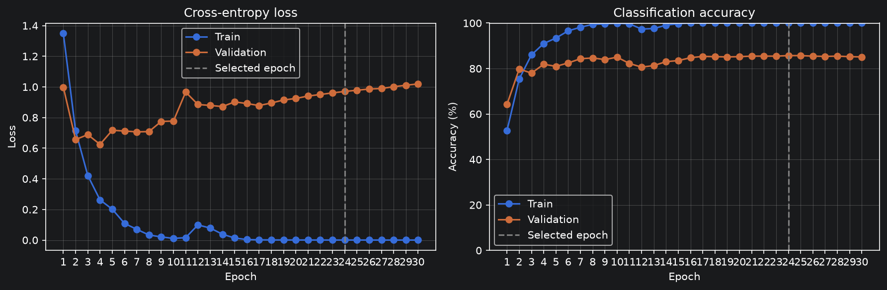
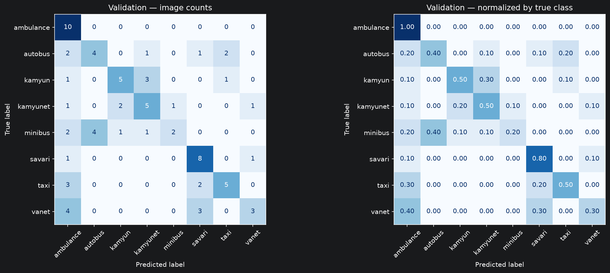

# Traffic Vehicle Classification

An eight-class classifier for cropped traffic-camera vehicle images. The project combines a careful data audit, controlled CNN experiments, ResNet18 transfer learning, error analysis, and a prediction interface that can flag uncertain cases for human review.

**Selected model:** ImageNet-pretrained ResNet18 with `layer4` and the classification head fine-tuned. On a fixed, group-safe **internal validation** set it correctly classified **833/867 images (96.1% accuracy, 0.961 macro-F1)**. A separate evaluator-held test set is unavailable here; no hidden-test score is claimed.

## What the system does

- Predicts one of `ambulance`, `autobus`, `kamyun`, `kamyunet`, `minibus`, `savari`, `taxi`, or `vanet` from a **vehicle crop**.
- Returns the predicted class, softmax scores for all eight classes expressed as percentages, the highest score as a percentage, and a `needs_review` flag.
- Supports both a JSON command-line predictor and a FastAPI file-upload endpoint.
- Treats the supplied `neysan` examples as part of the broader `vanet` target class, keeping the output taxonomy at eight classes.

This is a crop classifier, not a vehicle detector for full traffic scenes. The confidence value is a model score, not a calibrated guarantee that the prediction is correct.

## Data and evaluation protocol

The source images are private and are **not included in this repository**. Two supplied data batches were used for development. Following the updated evaluation guidance, the earlier supplied `test` folder could be included in the development pool; the actual final test set is held separately by the evaluators and was never used for model selection.

The audit inventoried **4,360 images** and excluded **24 exact extra copies** from the eligible pool, leaving **4,336 eligible unique images**. Content hashes identify exact duplicates even when filenames differ. Perceptual hashes group near-duplicates before splitting. A fixed seed (`42`) and `StratifiedGroupKFold` create a development split that separates near-duplicate groups while retaining representation across class and source:

| Source | Training | Validation |
|---|---:|---:|
| Source-labelled images | 1,865 | 467 |
| `unclean` images | 1,405 | 350 |
| `neysan` images, mapped to `vanet` | 199 | 50 |
| **Total** | **3,469** | **867** |

Labels from `unclean` remain marked as provisional unless reviewed; recorded review decisions override source labels. The private split manifest and review inventory are intentionally excluded from Git. [The aggregate audit summary](reports/data_summary.json) and the split-building code document the public, reproducible parts of the process. Results from older split versions remain in the JSON record with a historical status and should **not** be compared directly with current-split results.

The target distribution in the fixed split is:

| Target class | Meaning | Training | Validation |
|---|---|---:|---:|
| `ambulance` | Ambulance | 329 | 82 |
| `autobus` | Bus | 416 | 104 |
| `kamyun` | Truck | 437 | 109 |
| `kamyunet` | Light truck | 403 | 102 |
| `minibus` | Minibus | 369 | 92 |
| `savari` | Passenger car | 441 | 110 |
| `taxi` | Taxi | 434 | 108 |
| `vanet` | Pickup, including neysan | 640 | 160 |

Class stratification aims to retain class proportions; it does not force every class to have the same number of images. Group constraints take priority over an exact 80/20 count for every class.

## Experimental design

The experiments address three questions: how far a small CNN trained from scratch can go, which architectural or training changes improve it, and how much ImageNet transfer learning adds on the same validation images. The comparison includes single-factor changes, combined settings, class-imbalance handling, and transfer learning.

### Models and preprocessing

| Model family | Feature channels | Pooling | Input and normalization | Parameters |
|---|---|---|---|---:|
| Two-convolution CNN | 3→16→32 | Two 2×2 MaxPool; AvgPool in its dedicated comparison | RGB, aspect-ratio-preserving padding to 128×128; mean/std 0.5 per channel | 267,240 |
| Four-convolution CNN, narrow | 3→16→32→32→32 | Two 2×2 MaxPool | Same CNN preprocessing | 285,736 |
| Four-convolution CNN, wider | 3→16→32→64→64 | Two 2×2 MaxPool | Same CNN preprocessing | 584,808 |
| Four-convolution CNN, 128 channels | 3→16→32→64→128 | Two 2×2 MaxPool | Same CNN preprocessing | 1,146,024 |
| Four-convolution CNN, four pooling stages | 3→16→32→64→128 | Four 2×2 MaxPool or four 2×2 AvgPool | Same CNN preprocessing | 162,984 |
| ResNet18 | ImageNet-pretrained backbone + eight-class FC head | Standard ResNet18 architecture | Direct resize to 224×224; ImageNet mean/std | 11,180,616 total; 4,104 trainable in FC-only mode |

The custom CNNs use 3×3 convolutions with padding 1 and ReLU activations, followed by a flattened linear classifier. With two pooling stages, the last 128-channel variant feeds a `128×32×32` tensor into its classifier. Four pooling stages reduce this to `128×8×8`, greatly reducing the classifier's parameter count. The four-pool model therefore tests both additional spatial downsampling and a smaller classifier; its improvement cannot be attributed to depth alone.

The CNN reference configuration uses seed `42`, batch size `32`, Adam with learning rate `0.001`, CrossEntropyLoss, no augmentation, no dropout, no weight decay, and no scheduler. Most runs train for 30 epochs. Dedicated comparisons change the named factor while retaining the common data split.

**Combined regularization** means all four of the following, on the architecture named in the row:

1. Training-only `RandomHorizontalFlip(p=0.5)`.
2. `Dropout(p=0.3)` before the final linear classifier.
3. Adam with `weight_decay=1e-4`.
4. `ReduceLROnPlateau`, monitoring validation loss with `factor=0.5` and `patience=2`.

Average pooling is a separate architectural choice. The final AvgPool experiment replaces all four MaxPool layers while retaining the same four combined settings. Validation images do not receive random augmentation.

### Transfer-learning procedure

ResNet18 is trained in two stages. First, the pretrained backbone is frozen and a new eight-class `fc` layer is trained with Adam at `1e-3`. Second, the saved feature-extraction checkpoint initializes fine-tuning: `layer4` uses learning rate `1e-4`, `fc` uses `1e-3`, and both parameter groups use weight decay `1e-4`. Earlier stages remain frozen. BatchNorm parameters and running statistics remain fixed during fine-tuning.

The ResNet18 preprocessing is deliberately simple: resize the supplied vehicle crop to 224×224, convert to a tensor, and normalize with ImageNet mean `[0.485, 0.456, 0.406]` and standard deviation `[0.229, 0.224, 0.225]`. It does not introduce an additional center crop. These preprocessing settings are stored with the final checkpoint and reused by the predictor.

## Complete experiment results

The full table is expanded below. It contains **all 18 current-split CNN runs** plus both selection criteria for each of the **two ResNet18 training stages**: 22 evaluation rows representing 20 training runs/stages. All rows evaluate the same **867 validation images**. The simulated-imbalance pair uses fewer training images, as shown.

**How to read the losses:** `Train loss` and `Val loss at selected epoch` come from the epoch whose accuracy is shown. `Lowest val loss in run` is the minimum over the entire recorded trajectory; the accuracy beside it was measured in that same epoch, which can differ from the selected epoch. CNN checkpoints are selected by highest validation accuracy. ResNet18 rows explicitly distinguish minimum-loss and maximum-accuracy selection. Two selection rows for one ResNet18 stage are two evaluations of the same training history, not independent experiments.

| Experiment / evaluated checkpoint | Train images | Selected / total epochs | Correct / validation | Val accuracy | Macro-F1 | Train loss at selected epoch | Val loss at selected epoch | Lowest val loss in run; accuracy then |
|---|---:|---:|---:|---:|---:|---:|---:|---:|
| Two-convolution CNN baseline — 30 epochs | 3,469 | 24/30 | 743/867 | 85.7% | 0.8574 | 0.0004 | 0.9704 | 0.6247 (ep. 4; acc. 81.9%) |
| Two-convolution CNN baseline — 10 epochs | 3,469 | 10/10 | 737/867 | 85.0% | 0.8486 | 0.0110 | 0.7770 | 0.6247 (ep. 4; acc. 81.9%) |
| Baseline + horizontal flip | 3,469 | 23/30 | 736/867 | 84.9% | 0.8483 | 0.0043 | 0.9288 | 0.5848 (ep. 7; acc. 83.2%) |
| Baseline + Dropout(0.3) | 3,469 | 11/30 | 734/867 | 84.7% | 0.8453 | 0.0502 | 0.7812 | 0.6277 (ep. 4; acc. 81.1%) |
| Baseline + Dropout(0.5) | 3,469 | 15/30 | 737/867 | 85.0% | 0.8504 | 0.0361 | 0.7808 | 0.5881 (ep. 4; acc. 81.8%) |
| Baseline with two AvgPool layers | 3,469 | 11/30 | 728/867 | 84.0% | 0.8392 | 0.0332 | 0.8831 | 0.6446 (ep. 4; acc. 79.8%) |
| Baseline + weight decay 1e-4 | 3,469 | 29/30 | 738/867 | 85.1% | 0.8491 | 0.0004 | 0.9757 | 0.6309 (ep. 4; acc. 81.0%) |
| Baseline + learning-rate scheduler | 3,469 | 24/30 | 743/867 | 85.7% | 0.8565 | 0.0038 | 0.7738 | 0.6247 (ep. 4; acc. 81.9%) |
| Baseline + combined regularization | 3,469 | 14/30 | 740/867 | 85.4% | 0.8510 | 0.0491 | 0.6201 | 0.5835 (ep. 10; acc. 84.4%) |
| Simulated imbalance + shuffled batches | 1,512 | 24/30 | 654/867 | 75.4% | 0.7336 | 0.0009 | 1.4573 | 0.9248 (ep. 5; acc. 72.1%) |
| Simulated imbalance + balanced batches | 1,512 | 11/30 | 663/867 | 76.5% | 0.7491 | 0.0059 | 1.2097 | 0.9924 (ep. 3; acc. 71.9%) |
| Baseline with BCEWithLogitsLoss | 3,469 | 14/30 | 741/867 | 85.5% | 0.8536 | 0.0020 | 0.2087 | 0.1329 (ep. 5; acc. 84.0%) |
| Four convolutions, 16→32→32→32; two MaxPool | 3,469 | 27/30 | 741/867 | 85.5% | 0.8515 | 0.0002 | 1.3276 | 0.6220 (ep. 4; acc. 79.2%) |
| Four convolutions, 16→32→64→64; two MaxPool | 3,469 | 26/30 | 743/867 | 85.7% | 0.8532 | 0.000069 | 1.4758 | 0.6055 (ep. 5; acc. 82.8%) |
| Four convolutions, 16→32→64→128; two MaxPool | 3,469 | 19/30 | 744/867 | 85.8% | 0.8573 | 0.0182 | 1.0625 | 0.5469 (ep. 4; acc. 83.6%) |
| Four convolutions, 16→32→64→128; four MaxPool | 3,469 | 15/30 | 768/867 | 88.6% | 0.8855 | 0.0027 | 0.7434 | 0.4695 (ep. 6; acc. 85.8%) |
| **Four MaxPool + combined regularization (best CNN)** | 3,469 | 20/30 | 788/867 | 90.9% | 0.9078 | 0.0314 | 0.4456 | 0.3951 (ep. 14; acc. 90.2%) |
| Four AvgPool + combined regularization | 3,469 | 28/30 | 777/867 | 89.6% | 0.8963 | 0.0440 | 0.5062 | 0.4382 (ep. 14; acc. 88.1%) |
| ResNet18, FC only — minimum validation loss | 3,469 | 30/30 | 797/867 | 91.9% | — | 0.1256 | 0.2274 | 0.2274 (ep. 30; acc. 91.9%) |
| ResNet18, FC only — highest validation accuracy | 3,469 | 24/30 | 804/867 | 92.7% | — | 0.1478 | 0.2301 | 0.2274 (ep. 30; acc. 91.9%) |
| ResNet18, layer4 + FC — minimum validation loss | 3,469 | 5/30 | 822/867 | 94.8% | — | 0.0097 | 0.1643 | 0.1643 (ep. 5; acc. 94.8%) |
| **ResNet18, layer4 + FC — highest validation accuracy (used by the API)** | 3,469 | 19/30 | 833/867 | 96.1% | 0.9614 | 0.000022 | 0.2145 | 0.1643 (ep. 5; acc. 94.8%) |


Macro-F1 weights each class equally. `—` means that metric was not retained for that evaluated epoch; it is not zero. Train loss is accumulated while weights change throughout an epoch; validation loss is measured after the epoch with training-only behavior disabled.

The underlying metrics and histories are in [experiment_results.json](reports/experiment_results.json). The 30-epoch CNN baseline summary is in that record, while its full history is saved in the private baseline checkpoint and used by the [notebook's comparison tables](notebooks/02_cnn_baseline.ipynb).

### Comparisons that need different interpretation

- **Training budget:** the 10-epoch CNN reference has a shorter budget than the 30-epoch experiments.
- **Simulated imbalance:** both runs use the same 1,512-image source-labelled training subset, with reduced `kamyun` and `kamyunet` representation. The balanced sampler draws four examples per class in each 32-image batch, reusing minority examples as needed. Compare these two runs with each other; their training pool differs from the full-data experiments.
- **BCE versus CE:** BCEWithLogitsLoss uses one-hot targets and independent class scores. Its numerical loss scale differs from CrossEntropyLoss, so `0.2087` for BCE cannot be interpreted as a lower classification loss than the CE runs. Single-class decisions still use the largest score.
- **Transfer learning:** ResNet18 has ImageNet pretraining, different preprocessing, and a different architecture. Its comparison measures the benefit of that complete approach, rather than isolating architecture alone.

### What changed when training continued from 10 to 30 epochs?

These are best-accuracy snapshots within the first 10 and all 30 epochs of the same recorded trajectories. They do not represent six fresh runs, and an epoch's loss is reported alongside that epoch's accuracy.

| Training trajectory | Search window | Best-accuracy epoch | Correct / 867 | Val accuracy | Val loss at that epoch |
|---|---|---:|---:|---:|---:|
| Two-convolution CNN | First 10 epochs | 10 | 737/867 | 85.0% | 0.7770 |
| Two-convolution CNN | First 30 epochs | 24 | 743/867 | 85.7% | 0.9704 |
| ResNet18, FC only | First 10 epochs | 7 | 788/867 | 90.9% | 0.3079 |
| ResNet18, FC only | First 30 epochs | 24 | 804/867 | 92.7% | 0.2301 |
| ResNet18, layer4 + FC | First 10 epochs | 7 | 832/867 | 96.0% | 0.1671 |
| ResNet18, layer4 + FC | First 30 epochs | 19 | 833/867 | 96.1% | 0.2145 |

The fine-tuning run gained one additional correct prediction after its first 10 epochs. Its highest accuracy occurred at epoch 19, while its minimum validation loss occurred at epoch 5. More epochs therefore did not improve every metric together, and the final epoch is not automatically the best checkpoint.

### What the experiments show

- **Single changes did not automatically beat the CNN baseline.** Dropout, flip, weight decay, and two-layer AvgPool did not exceed the 30-epoch reference's 743 correct predictions. The scheduler matched 743/867 while reducing the selected epoch's validation loss from `0.9704` to `0.7738`.
- **Combining settings depended on the architecture.** The two-convolution combination reached 740/867 (`85.4%`, loss `0.6201`), three fewer correct predictions than the reference. With four convolutions and four MaxPool stages, the same combination improved the plain four-pool CNN from 768 to 788 correct predictions (`88.6%` to `90.9%`) and reduced selected-epoch loss from `0.7434` to `0.4456`.
- **Depth and width alone gave limited gains.** Adding two convolutions with only the original two pooling stages produced 741, 743, and 744 correct predictions for the three width variants. Adding pooling after all four convolutions increased this to 768 with substantially fewer parameters in the classifier.
- **MaxPool outperformed AvgPool in the matched four-pool comparison.** Both regularized models have 162,984 parameters, the same initialization, optimizer settings, data split, and 30-epoch budget. MaxPool reached 788/867 versus 777/867 for AvgPool: 11 more correct predictions. Its selected-epoch loss was also lower (`0.4456` versus `0.5062`), as was its minimum loss across the run (`0.3951` versus `0.4382`).
- **Balanced batches helped in the simulated-imbalance setting.** Correct predictions increased from 654 to 663 and macro-F1 from `0.7336` to `0.7491`. This result applies to the matched reduced-data experiment.
- **Transfer learning produced the strongest recorded classifier.** Fine-tuning `layer4` and `fc` reached 833/867 (`96.1%`, macro-F1 `0.9614`), 45 more correct predictions than the best CNN trained from scratch.

### Selected checkpoint: accuracy and loss answer different questions

The ResNet18 checkpoint used by the API is selected by **highest validation accuracy**, at epoch **19**: **833/867 correct**, **96.1% accuracy**, and **validation loss 0.2145**. The minimum-loss checkpoint from the same run is epoch **5**: **822/867 correct**, **94.8% accuracy**, and **loss 0.1643**. Both results are preserved in the table.

Accuracy counts whether the highest-scoring class is correct. CrossEntropy also depends on the probability assigned to the true class, so a model can classify more images correctly while making a few errors with greater confidence and receiving a higher loss. Choosing the accuracy checkpoint does not mean it also minimizes loss or has calibrated confidence.

The final weights, class mapping, preprocessing parameters, selection metadata, and review threshold are stored locally in `checkpoints/resnet18_final.pt`. `predict.py` reconstructs the architecture, loads these weights, and runs inference without retraining. CNN comparison checkpoints are written by `scripts/run_experiments.py`; the ResNet18 selection and export are recorded in the notebook.

At inference time, `models.resnet18(weights=None)` creates the architecture without loading the original ImageNet weights. After replacing `fc` with an eight-class layer, `load_state_dict(checkpoint["model_state_dict"])` restores the saved project weights, including the fine-tuned layers. The predictor therefore uses the trained checkpoint rather than a newly initialized model. `eval()` and `torch.inference_mode()` then configure the forward pass for inference.

### Retained results from an earlier data split

The record also preserves these two earlier CNN experiments. Their validation set had **467 images**, and their training pools differ from the unified split above. They document earlier measurements and are **not a ranking against the current 867-image results**.

| Earlier recorded experiment | Train images | Validation images | Selected / recorded epochs | Correct | Val accuracy | Macro-F1 | Val loss at selected epoch |
|---|---:|---:|---:|---:|---:|---:|---:|
| CNN with provisional known-class unclean labels | 3,619 | 467 | 9/10 | 401/467 | 85.9% | 0.8590 | 0.6507 |
| CNN with unclean + neysan mapped to vanet | 3,807 | 467 | 20/29 | 415/467 | 88.9% | 0.8900 | 0.6981 |

The second record contains 29 completed epochs; its selected epoch is 20. Its separate historical neysan holdout had 43/47 images classified as `vanet` (`91.5%`). This holdout is not an additional current-split test set. The historical `88.9%` and the current CNN baseline's `85.7%` use different evaluation populations, so subtracting them does not establish a model regression.

## Error analysis and human review

The project records per-class precision, recall, F1, confusion counts, normalized confusion matrices, training curves, and inspected misclassifications. `kamyun` and `kamyunet` remain separate output classes after reviewing their mutual confusion and the intended label definitions. Uncertain and potentially mislabeled `unclean` images are treated explicitly rather than silently assumed to be clean.

The selected ResNet18 checkpoint uses a **0.90** softmax-confidence threshold chosen from internal validation. On those 867 validation images, **35** were sent to review, including **11** of the model's **34** mistakes. The other **23** mistakes were not caught by that threshold. The review flag therefore helps triage cases but is not a substitute for inspecting the prediction, especially under domain shift or on unrelated objects.





## Evaluation limits

The results describe one development split and recorded seed, rather than repeated-seed estimates or external-test performance. Multiple architectures and the review threshold were selected using the same validation set, so its score is a development estimate and may be optimistic. Label review also informed the current split; it is not an untouched external benchmark. The audit records 400 provisional validation labels, which makes label quality a relevant limit on the reported metrics.

Exact hashes and perceptual groups reduce leakage from identified duplicates, but do not prove that every visually related image has been found. Performance on different cameras, lighting, crops, or unrelated objects can differ. The eight-class softmax and review threshold do not implement a separately trained unknown-object detector. A high score can still accompany an incorrect prediction.

## Repository layout

```text
api.py                    FastAPI upload and health endpoints
predict.py                Reusable ResNet18 predictor and JSON CLI
predict_folder.py         Folder inference, with optional labeled evaluation
scripts/data_split.py     Private, duplicate-aware development split
scripts/run_experiments.py CNN ablations and checkpoint/report writing
notebooks/01_data_audit.ipynb
notebooks/02_cnn_baseline.ipynb
reports/data_summary.json
reports/experiment_results.json
reports/figures/           Aggregate plots
requirements.txt          Recorded Python dependencies
```

The ignored `dataset/`, `dataset_extra/`, `checkpoints/`, and private review/split files are required only where the relevant training or inference step uses them.

## Setup and reproduction

The recorded environment used **Python 3.14** and the versions in [`requirements.txt`](requirements.txt). From the repository root:

```bash
python3.14 -m venv .venv
source .venv/bin/activate
python -m pip install -r requirements.txt
```

Full training reproduction requires authorized access to both image batches and the private review inventory. Place the datasets in `dataset/` and `dataset_extra/`, and keep the reviewed inventory at `reports/data_review_decisions.csv`. These paths are ignored by Git. Then create the private split:

```bash
python scripts/data_split.py --write
```

The split code checks exact duplicates, builds near-duplicate groups, and writes the ignored `reports/base_split.json`. Its fingerprint must match the one recorded with an experiment before results are compared. CNN experiments can be rerun independently, for example:

```bash
python scripts/run_experiments.py four_conv_128_4pool_regularized --epochs 30
python scripts/run_experiments.py four_conv_128_4avgpool_regularized --epochs 30
```

The data-audit workflow is in [`notebooks/01_data_audit.ipynb`](notebooks/01_data_audit.ipynb); the CNN, transfer-learning, and error-analysis workflow is in [`notebooks/02_cnn_baseline.ipynb`](notebooks/02_cnn_baseline.ipynb). A locally available final checkpoint is required for inference. Checkpoints are intentionally **not** distributed in this repository.

## Prediction interfaces

The command-line interface accepts one image path and writes JSON:

```bash
python predict.py /path/to/cropped_vehicle.jpg
```

To start the FastAPI server in PyCharm, open `api.py`, select the project's `.venv` interpreter, and click **Run**. The file starts Uvicorn at `http://127.0.0.1:8000`. From a terminal in the repository root, the equivalent direct command is:

```bash
.venv/bin/python api.py
```

You can also start the same app through Uvicorn's module command:

```bash
.venv/bin/python -m uvicorn api:app --host 127.0.0.1 --port 8000
```

Stop the previous server before starting another one on port `8000`; otherwise the new process reports `address already in use`. Restart the server after changing API code so it loads the new version.

Open `http://127.0.0.1:8000/docs` for the interactive upload form. In Postman, send **POST** `http://127.0.0.1:8000/predict`, choose **Body → form-data**, create a key named **`file`**, set its type to **File**, and select an image. The same request with `curl` is:

```bash
curl -X POST http://127.0.0.1:8000/predict \
  -F "file=@/path/to/cropped_vehicle.jpg"
```

**Postman upload detail:** `file` is the key name; `File` is the field type. Both must be set in the same enabled row. Let Postman generate the multipart `Content-Type` header. An empty key or a JSON body produces a missing-`file` validation error.

`GET /health` reports model readiness and the eight class names. The server loads the final ResNet18 checkpoint once and reuses it across requests. It returns HTTP 400 for an unreadable image, 413 for an upload over 10 MB, and 503 if the checkpoint is unavailable. The response has this structure (illustrative values):

```json
{
  "predicted_class": "taxi",
  "confidence": "93%",
  "probabilities": {
    "ambulance": "1%",
    "autobus": "1%",
    "kamyun": "1%",
    "kamyunet": "1%",
    "minibus": "1%",
    "savari": "1%",
    "taxi": "93%",
    "vanet": "1%"
  },
  "needs_review": false
}
```

For a folder of images, use the batch predictor. An unlabeled folder can be flat or nested; it produces one numeric prediction record per image:

```bash
python predict_folder.py /path/to/images --output .local/predictions.json
```

When images are grouped under class folders (`ambulance/`, `autobus/`, and so on), add `--labeled` to compute accuracy. A `neysan/` folder is evaluated as the existing `vanet` output class. The result reports accuracy on the eight-class images, on all images including neysan, and on neysan alone:

```bash
python predict_folder.py /path/to/labeled_images --labeled --output .local/evaluation.json
```

For a dataset whose ground truth treats `neysan` as a separate ninth class, add `--neysan-label neysan`. This evaluates against that label without silently remapping it to `vanet`. The selected model still has only eight outputs, so it cannot predict the separate ninth class; use this option to report that limitation honestly, not as a substitute for training a nine-class model.

The batch JSON keeps probabilities as numbers in `[0, 1]` for programmatic evaluation; the single-image CLI and API display percentages. The optional `.local/` output directory is excluded from Git. The script loads one checkpoint and reuses it for every image.

Both the API and CLI format `confidence` and `probabilities` as **percentage strings**. For example, a raw probability of `4e-6` is returned as `"0.0004%"`, with the multiplication by 100 already applied. Fixed decimal formatting avoids scientific notation without rounding small nonzero probabilities down to zero. The internal predictor still uses numerical probabilities in `[0, 1]`; `needs_review` compares those raw values with the stored threshold before formatting. Consumers that need a numerical percentage can remove `%` and parse the remaining decimal; divide by 100 to recover a probability.

For a quick demo, use a publicly available **cropped vehicle** image rather than a private dataset image. Predictions on arbitrary internet photos illustrate the interface; they are not an accuracy evaluation.

## Repository safety

Raw datasets, private split/review files, and trained checkpoints are excluded by [`.gitignore`](.gitignore). The repository contains code and aggregate results, not the NDA-protected images or model weights. The reported scores are from **internal validation**; final performance on the held-out evaluator dataset remains unknown. The API can be checked manually through Postman or `/docs` with a cropped vehicle image that is not part of the private dataset.
